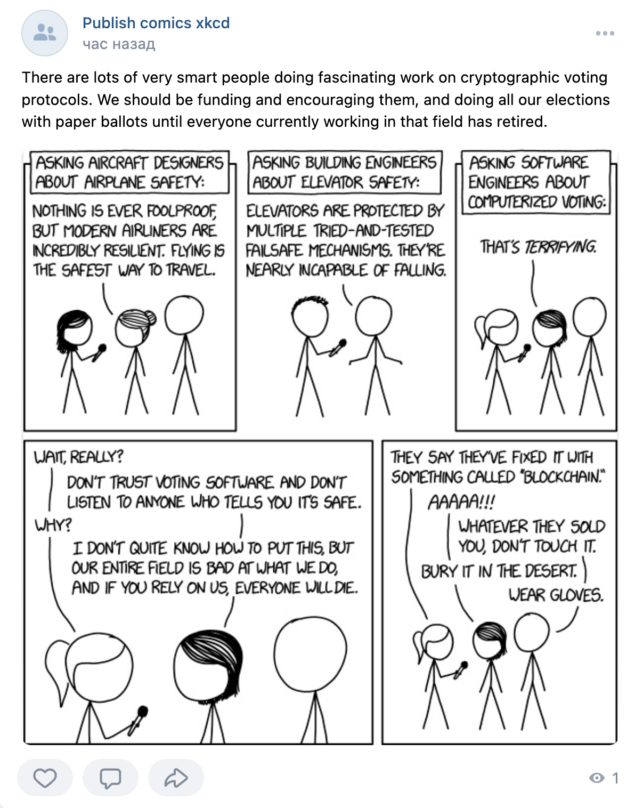

# Publish comics xkcd on VKontakte group wall

This is a Python code that publishes a random XKCD comic strip on a [VKontakte (VK)](https://vk.com/) group wall.
The code consists of a single Python file, ```publish_comics_vk.py```, which uses the following libraries: os, random, requests, and environs.

The program uses the [XKCD JSON API](https://xkcd.com/json.html) to retrieve a random comic strip from the XKCD website.
It then uploads the comic strip image to the VK wall using VK API methods, along with the image's alt text as the post message.

To use the program, you will need to create a [VK group](https://vk.com/groups?tab=admin), 
a [VK standalone application](https://vk.com/apps?act=manage) and obtain the application client id (you can find it in your application settings),
an access token with [Implicit Flow](https://vk.com/dev/implicit_flow_user) and a [group ID](https://regvk.com/id/).
The access token, group ID, and VK API version should be stored in a ```.env``` file in the format specified below.

Note that the program deletes the comic strip image file from your local storage after publishing it on the VK group wall.

## Setup
1. Clone the repository to your local machine
2. Create a virtual environment in the project directory
```
python -m venv env
```
3. Activate the virtual environment:

for Windows:
```commandline
.\env\Scripts\activate
```

for Linux or macOS:
```commandline
source env/bin/activate
```
4. Install the requirements: 
```commandline
pip install -r requirements.txt
```
6. Set environment variables in a file named .env. 
Create it in the root directory of the project and add the following variables:
```
VK_APPLICATION_ACCESS_TOKEN=<YOUR_VK_APPLICATION_ACCESS_TOKEN>
VK_USER_ID=<YOUR_VK_USER_ID>
VK_API_VERSION=<YOUR_VK_API_VERSION>
VK_GROUP_ID=<YOUR_VK_GROUP_ID>
```

You can get the above variables by the links in the beginning of this README file.

## Usage

To run the program, run the ```publish_comics_vk.py``` file in a Python environment.
The program will retrieve a random comic strip, upload it to the VK wall, and publish it along with its alt text message. 
In the case of success you will see the following message:
```
Комикс успешно опубликован. Номер публикации: <POST_ID>
```
where ```<POST_ID>``` is the ID of the published post.

On the VK group wall, you will see a post with the comic strip image and its alt text as the post message.

## An example of the published comics



## Contributing

If you have suggestions for how this code could be improved, please open an issue or a pull request.
Contributions from the community are always welcome!
